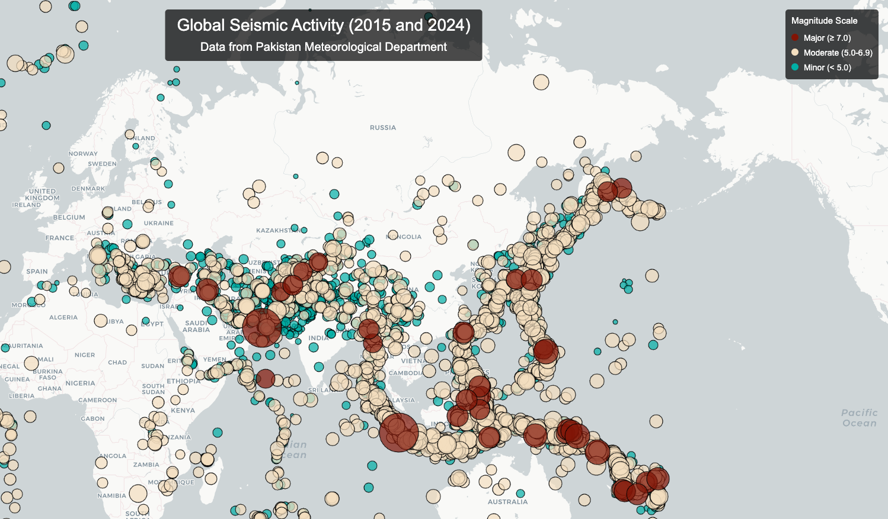
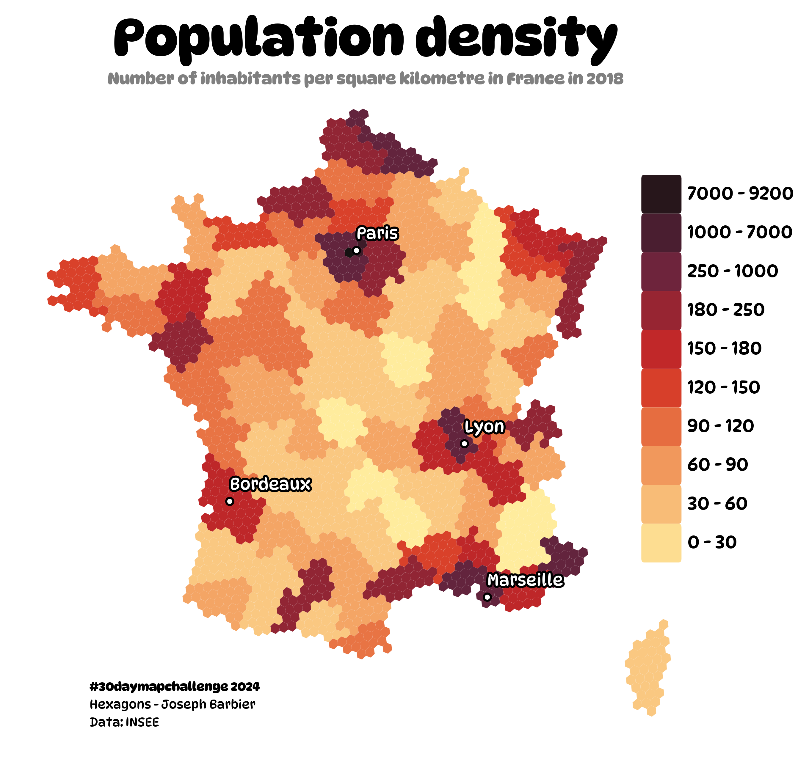
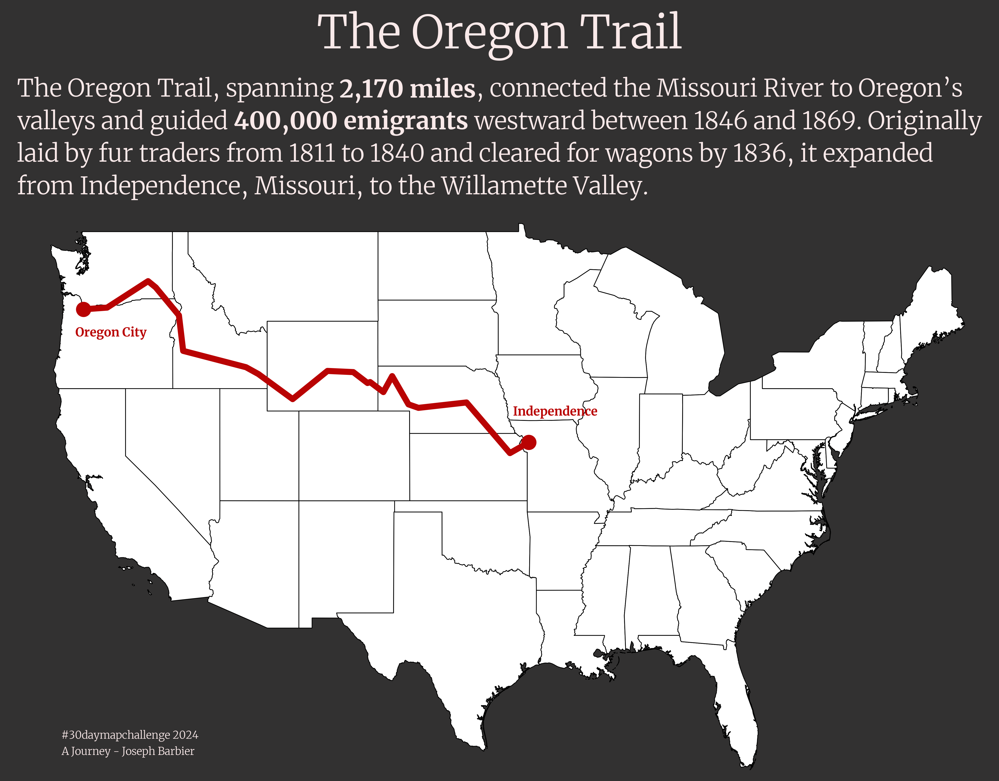

# 30DayMapChallenge

My 2024 entries for the [30 Day Map Challenge](https://30daymapchallenge.com/), organized by [Topi Tjukanov](https://tjukanov.org/aboutme).

> This README will contain all the images for each category, but all the source code and instructions on how to reproduce the graphs can be found in `src/`.

   

## 1 - Points

 

## 2 - Lines

 

## 3 - Polygons

 

## 4 - Hexagons

 

## 5 - A journey

 

## 6 - Raster

 

## 15 - My Data

 
