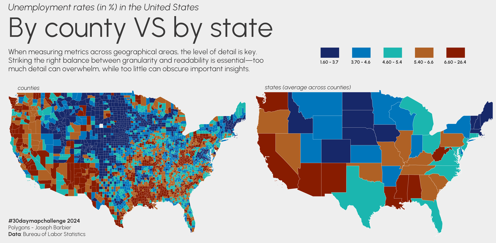
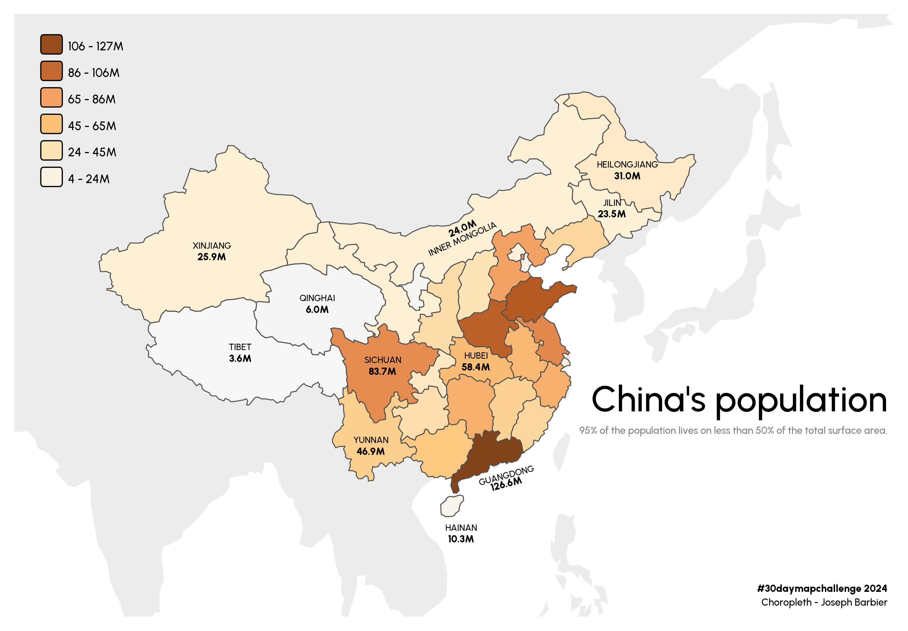

# 30DayMapChallenge

My 2024 entries for the [30 Day Map Challenge](https://30daymapchallenge.com/), organized by [Topi Tjukanov](https://tjukanov.org/aboutme).

> This README will contain all the images for each category, but all the source code and instructions on how to reproduce the graphs can be found in `src/`.

   

## 1 - Points

[Browse the map](https://josephbarbierdarnal.github.io/30DayMapChallenge/earthquakes)

 

## 2 - Lines

 

## 3 - Polygons

 

## 4 - Hexagons

 

## 5 - A journey

 

## 6 - Raster

 

## 7 - Vintage style

 

## 8 - HDX

 

## 9 - AI only

Skipped

 

## 10 - Pen & Paper

Skipped

 

## 11 - Arctic

 

## 12 - Time and space

 

## 13 - A new tool

 

## 14 - A world map

 

## 15 - My Data

 

## 16 - Choropleth

 

## 17 - Collaborative

[Browse the map](https://josephbarbierdarnal.github.io/30DayMapChallenge/collaborative)

 

## 18 - 3D

Skipped

 

## 19 - Typography

Skipped

 

## 20 - OSM

Skipped

 

## 21 - Conflict

 
